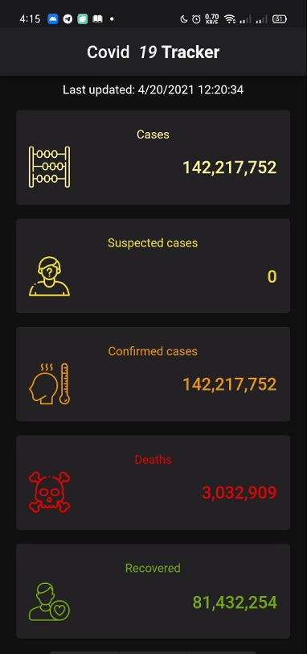

# corona tracker 😷

 

  
 
  <h2 align="center">corona tracker 😷</h2>

  
A Flutter project Used for tracking the number of Cases confirmed cases, recovered and death Depinding on Data From  <https://ncov2019-admin.firebaseapp.com>

---

## Sections

- [Packages Used](#Packages_Used)
- [App Screen](#App_Screen)
- [Make The Same App](#Make_The_App)

---

## Packages_Used

- http
- provider
- intl
- shared_preferences

---

## App_Screen

## 

## Make_The_App

### To Make An App Like It: Check The Course Below

- Course Author: Andrea Bizzotto
- CourseLink: <https://www.udemy.com/course/flutter-rest-api-crash-course-build-a-coronavirus-app/>
